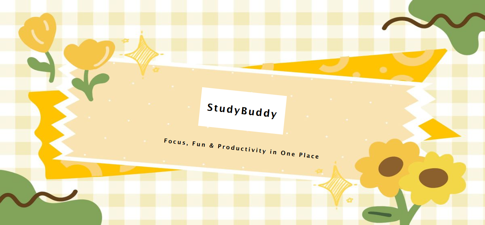
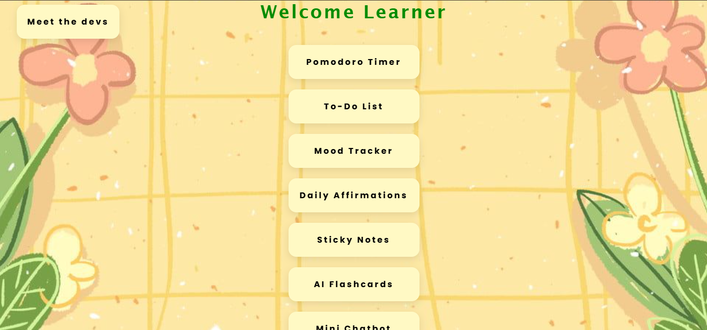
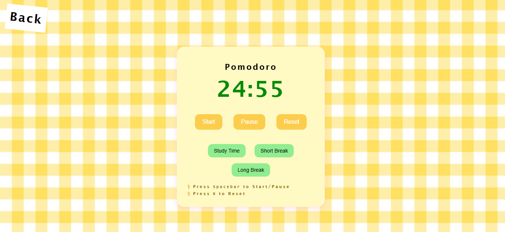
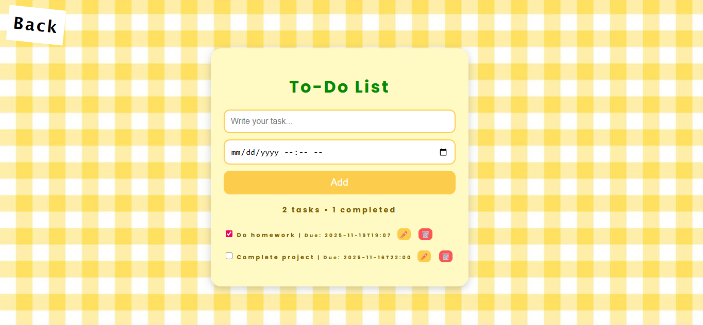
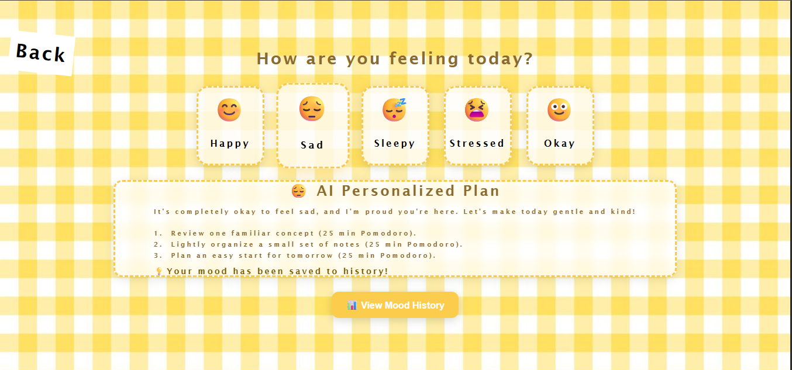

# Study Buddy CS Girlies Hacakthon Project

**Your all-in-one study dashboard — Pomodoro timer, AI study plan, flashcards, mood tracker, and more!**

---

## Table of Contents

1. [Project Overview](#project-overview)
2. [Hackathon Track](#hackathon-track)
3. [Features](#features)  
4. [Project Structure](#project-structure)  
5. [Tech Stack](#tech-stack)  
6. [Installation](#installation)  
7. [Usage](#usage)  
8. [AI Integrations](#ai-integrations)  
9. [Deployment](#deployment)  
10. [License](#license)  

---

## Project Overview

Study Buddy is a personalized dashboard for students that combines organization, motivation, and AI assistance in one place. It helps students:

- Focus with Pomodoro timer  
- Organize tasks with a To-do list  
- Track mood and create AI-generated study plans  
- Revise using AI flashcards  
- Stay motivated with daily affirmations  
- Use draggable sticky notes  
- Chat with a mini AI bot powered by LangChain + FAISS  

The goal is to make student life less stressful and more productive, all in a cute, girly, and calming interface.

---

## SCREENSHOTS

Here are some screenshots of Study Buddy in action:

<div style="display: flex; gap: 10px; flex-wrap: nowrap; overflow-x: auto; align-items: stretch;">
  
  
  
  
  
</div>


## HACKATHON TRACK

**Track:** Automate Learning: Build Smarter Study Tools  

We are submitting Study Buddy under this track because it focuses on smarter study tools, AI assistance, and productivity enhancements for students.

---

## Features

- **Pomodoro Timer:** Focused study sessions with break intervals.  
- **To-do List:** Add, edit, complete, and delete tasks.  
- **Mood Tracker → AI Study Plan:** Track your mood and get personalized study suggestions.  
- **Daily Affirmations:** Motivational messages to keep students energized.  
- **Sticky Notes:** Drag-and-drop notes for quick reminders.  
- **AI Flashcards:** Smart revision tool.  
- **Mini AI Chatbot:** Chat with an AI bot that remembers notes (LangChain + FAISS).  

---

## Project Structure

```bash
/CS-Girlies-Hackathon
├── Assets/
│   ├── CSS/
│   │   └── style.css
│   ├── Images/
│   │   └── (all images)
│   ├── Script/
│   │   ├── affirmations.js
│   │   ├── chatbot.js
│   │   ├── flashcards.js
│   │   ├── index.js
│   │   ├── main.js
│   │   ├── mood-tracker.js
│   │   ├── pomodoro.js
│   │   └── stickynotes.js
│   └── Pages/
│       ├── affirmations.html
│       ├── chatbot.html
│       ├── devs.html
│       ├── flashcards.html
│       ├── main.html
│       ├── mood-tracker.html
│       ├── pomodoro.html
│       ├── stickynotes.html
│       └── todo-list.html
├── backend/
│   ├── server.js
│   ├── node_modules/
│   ├── package-lock.json
│   └── package.json
├── index.html
├── README.md
└── .gitignore
```
---

## Tech Stack

- **Frontend:** HTML, CSS, JavaScript  
- **Backend:** Node.js + Express  
- **AI Integration:** Gemini API  
- **AI Chatbot:** LangChain + FAISS VectorStore  
- **Hosting & Version Control:** GitHub  
- **Development Environment:** VS Code  

---

## Installation

1. Clone the repository:  
```bash
git clone https://github.com/emaaanbutt/CS-Girlies-Hackathon-Study-Tool.git
```
2. Navigate to server.js:
```bash
cd CS-Girlies-Hackathon-Study-Tool/backend/server.js
```
3. Install dependencies:
```bash
npm install
```
4. Create a .env file in server/ with your API keys:
```bash
GEMINI_API_KEY=your_gemini_api_key
```

## Usage

1. Start the server:
```bash
node server.js
```
or if you have nodemon installed:
```bash
nodemon server.js
```
2.  Visit the following link in your browser:
```bash
http://localhost:3000
```
3. Use the dashboard:

- Start Pomodoro sessions
- Add tasks in To-do list
- Track mood and get AI study suggestions
- Use AI flashcards
- Chat with the AI bot
- Drag sticky notes around 

## AI Integrations

- **Gemini API:** Powers mood-based AI study plans and flashcards.  
- **LangChain + FAISS:** Used in the mini AI chatbot to remember user notes and provide context-aware answers.  

## Deployment

- **Hosted on GitHub Pages:** [link-to-your-hosted-dashboard]  
- **Backend:** Runs on local Node.js server.
  
## License

This project is licensed under the MIT License.
